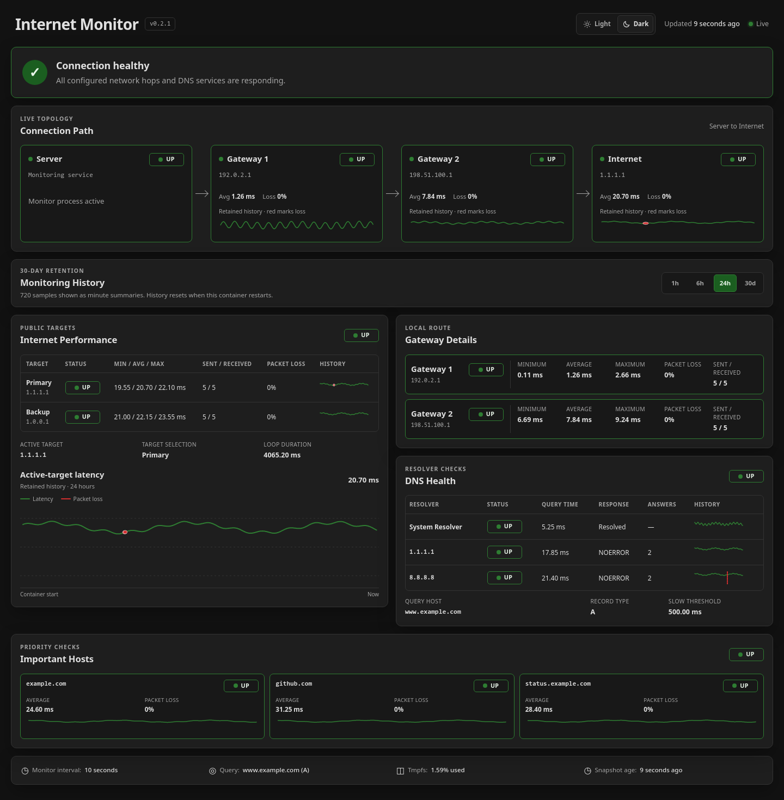

# Internet Monitor

Internet Monitor 1.0 is a Docker-first Python service for Internet and gateway
reachability, packet loss, latency, system DNS resolution, and direct DNS-server
health checks.

[](docs/web-interface.png)

## Features

- Concurrently checks primary, backup, and two optional gateway targets with
  fping.
- Uses the container resolver and concurrently runs `dig` against every
  configured DNS server.
- Pings up to three important hostnames only while the system resolver and at
  least one configured DNS server are responding.
- Diagnoses local gateway, upstream gateway, ISP/Internet, and DNS problems.
- Displays a live Server → Gateway 1 → Gateway 2 → Internet topology, detailed
  ping statistics, and 30 days of shared ping/DNS history that marks packet loss
  and failed DNS checks in red. Small graphs show low, midpoint, and high scale
  guides with matching values; the large latency graph includes intermediate
  millisecond values.
- Shows container-scoped CPU and memory usage with the same ephemeral retained
  history, without requiring host mounts or Docker socket access.
- Sends independent Pushover alerts for gateways, DNS servers, and important
  hosts, with queued delivery retries and capped exponential backoff.
- Shows web and Pushover warnings when ephemeral `/tmp` usage reaches 80%, and
  a critical alert at 95%.
- Writes human-readable application logs only to the Docker console.
- Supports Docker Compose, Portainer, and a dedicated single-replica Swarm stack.
- Includes an optional manager-side placement reconciler that selects a healthy
  `internet-monitor=true` node, permits fallback, and automatically fails back.

## Configuration

All operator settings are Docker environment variables. Start with
`.env.example`; the default DNS servers are `1.1.1.1` and `8.8.8.8`, and both
query `DNS_HOST`. Version 0.2.0 removes the old `INTERNET_MONITOR_` prefix from
every variable; old prefixed names are intentionally ignored.

`WEB_PORT` selects the Docker host or Swarm ingress port used to reach the
dashboard. The container's internal web port is fixed at `5005`.

`GATEWAY_1_IP` and `GATEWAY_2_IP` are optional.
When configured, each value must be a pingable IPv4 or IPv6 address representing
the next device in order toward the Internet.

Set `IMPORTANT_HOST_1` through `IMPORTANT_HOST_3` to watch priority hostnames.
These checks pause instead of waiting on resolution when DNS is unavailable.

No monitoring history or logs are persisted outside the container. The tmpfs
history is shared by every browser and survives page reloads while the container
is running. It keeps exact samples for 6 hours, minute summaries for 24 hours,
and loss-preserving hourly summaries for 30 days. Older data is deleted.
Complete history snapshots are published at most once per minute to keep
background CPU stable; live status still updates at the configured monitoring
interval. Routine dashboard polling is not access-logged; warnings, errors, and
monitoring events remain available in the Docker console. A sustained issue is
warned once instead of being logged every cycle; use `DEBUG` temporarily when
per-cycle diagnostics are needed.

Pushover credentials can be supplied through environment variables or Docker
secrets.

For deployment, Swarm preferred-node setup, and secrets, see
[INSTALL.md](INSTALL.md). The placement utility runs on one stable, nonpreferred
Swarm manager; the application container never receives the Docker API socket.

## Web Interface

The dashboard is published on port `5005` by default. Its light or dark theme
follows the device setting until the browser saves a manual choice. It polls the
sanitized same-origin status endpoint at the monitor interval without reloading
the page. History controls provide 1 hour, 6 hour, 24 hour, and 30 day views for
container CPU and memory, gateways, Internet targets, the system resolver,
configured DNS servers, and important hosts. Container memory includes a
percentage when the deployment sets a finite memory limit; otherwise it shows
current MiB. On desktop, Internet Performance sits beside compact Gateway and
DNS cards, with up to three Important Hosts arranged in a full-width row below.
The cards collapse to a single stack on mobile. The page also reports the live
capacity of the ephemeral tmpfs.
`WEB_ALLOWED_HOSTS` can restrict direct client addresses;
forwarded addresses are not trusted unless reverse-proxy support is added later.

## Development

```bash
python -m pip install -r requirements-dev.txt
python -m pytest
docker compose config
docker stack config --compose-file docker-stack.yml
```
